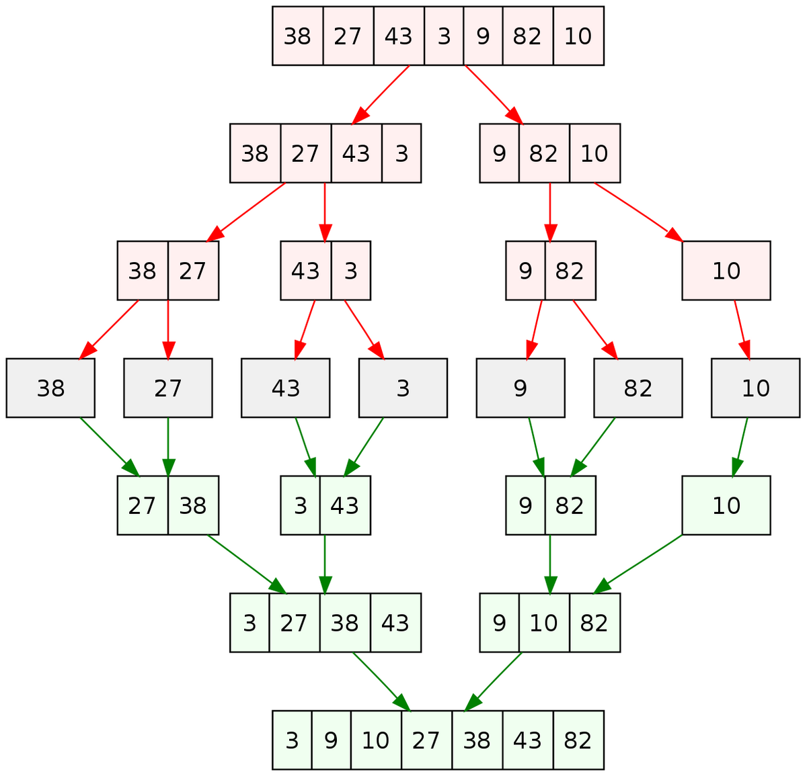

# Divide and Conquer, Sorting and Searching, and Randomized Algorithms by Stanford University

This repository contains the solution of the programming assignments in the first course of the famous [Algorithms Specialization by stanford university](https://www.coursera.org/specializations/algorithms) as the following:

- The Karatsuba multiplication algorithm.
- The merge sort algorithm with counting number of inversions.
- Three implementations of the quick sort using 3 different ways of choosing the pivot and comparing the number of comparisons in each way.
- The Randomized contraction algorithm for the min cut problem.
